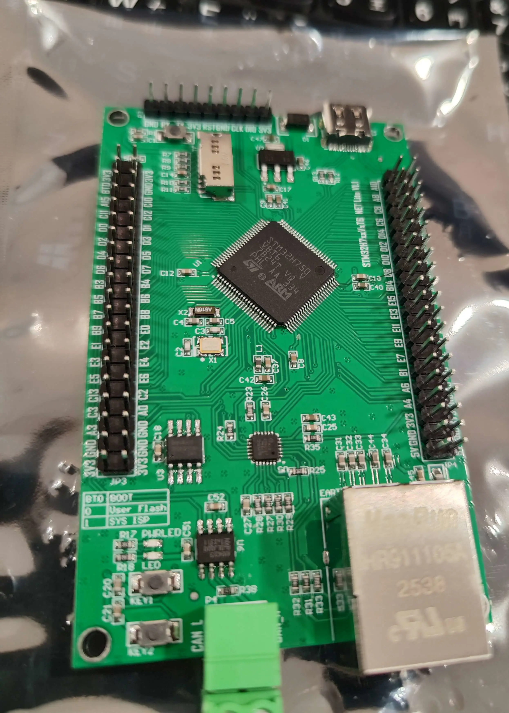

# STM32H750VBT6 開發板 SDK

> STM32H750VBT6 + LAN8720A 乙太網路 / CANFD / USB 多功能開發板
> 原廠範例整理、學習筆記與未來 GCC 移植紀錄


購買連結：[淘寶商品頁面](https://item.taobao.com/item.htm?id=763078439777)



---

## 硬體規格

| 項目 | 說明 |
|------|------|
| **主控晶片** | STM32H750VBT6（Arm Cortex-M7，480 MHz） |
| **內建 Flash** | 128 KB（零等待） |
| **SRAM** | 1 MB（含 TCM / AXI / SRAM1~3） |
| **外擴 NOR Flash** | Boya Micro BY25Q32ESTI（QSPI，32 Mbit，支援 XIP） |
| **乙太網路 PHY** | Microchip LAN8720A，RMII 介面，10/100 Mbps |
| **CAN** | FDCAN1 × 1（支援 Classic CAN / CAN FD），收發器 NXP TJA1042 |
| **USB** | USB FS（Device / Host / OTG） |
| **其他介面** | SPI、I²C、UART / RS232、TIM、ADC、DAC、SDMMC |
| **電源** | USB Type-C 供電，3.3 V / 5 V |
| **工作溫度** | −20 °C ～ 85 °C |

電路圖：[docs/750NetLiteSch_V1.1.pdf](750NetLiteSch_V1.1.pdf)

---

## 目錄結構

```
.
├── docs/
│   └── 750NetLiteSch_V1.1.pdf              # 硬體電路圖（賣家提供）
├── 软件发布/                                # 賣家 Keil 範例（版權歸賣家，詳見授權說明）
│   ├── ADC电压采集/
│   │   ├── ADC—双重ADC-单通道—交替采集/
│   │   ├── ADC—独立模式-单通道—DMA/
│   │   ├── ADC—独立模式-单通道—中断/
│   │   ├── ADC—独立模式-多通道—DMA/
│   │   └── ADC—电压采集/
│   ├── CAN通信实验/
│   │   ├── CAN参考资料/
│   │   ├── CAN—双机通讯/
│   │   └── CAN—回环测试/
│   ├── DAC输出正弦波/
│   ├── EXTI一外部中断/
│   ├── GPIO输入一按键检测/
│   ├── LPTIM—低功耗定时器PWM输出/
│   ├── LWIP_Done/
│   │   ├── lwip_dhcp/
│   │   ├── lwip_http/
│   │   ├── lwip_http_led/
│   │   ├── lwip_ping_raw/
│   │   ├── lwip_tcpclient_raw/
│   │   ├── lwip_tcpecho/
│   │   ├── lwip_tcpecho_raw/
│   │   └── lwip_udpecho/
│   ├── SDMMC—SD卡读写测试/
│   ├── SPI一读写串行FLASH/
│   ├── TIM—基本定时器定时/
│   └── USART一串口通信/
│       ├── UART5—RS232接发/
│       ├── USART2—RS232接发/
│       ├── USART—USART1指令控制LED/
│       ├── USART—USART1接发/
│       └── USART—USART2指令控制LED/
│
└── my_projects/                 # 本人移植專案（MIT，規劃中）
    └── (待新增)
```

每個 Keil 範例的內部結構：

```
<範例名稱>/
├── Libraries/    # STM32 HAL / 驅動函式庫
├── Listing/      # 編譯清單輸出
├── Output/       # 編譯產出（.o、.d、.bin 等，已加入 .gitignore）
├── Project/      # Keil 專案檔（.uvprojx、.uvoptx）
├── User/         # 使用者程式碼（main.c 等）
└── 必读说明.txt  # 賣家說明文件（每個範例請優先閱讀）
```

---

## 原廠範例說明

### ADC 電壓採集

| 範例 | 說明 |
|------|------|
| 独立模式-单通道—中断 | ADC 單通道，中斷觸發讀取 |
| 独立模式-单通道—DMA | ADC 單通道，DMA 傳輸 |
| 独立模式-多通道—DMA | ADC 多通道掃描，DMA |
| 双重ADC-单通道—交替采集 | 雙 ADC 交替，提升採樣率 |
| ADC—电压采集 | 基本電壓量測範例 |

### CAN 通信

| 範例 | 說明 |
|------|------|
| CAN—回环测试 | FDCAN1 Loopback 自測，不需外部裝置 |
| CAN—双机通讯 | 兩板互傳，收發器 TJA1042，需終端電阻（120 Ω） |

### 乙太網路（LwIP）

| 範例 | 說明 |
|------|------|
| lwip_dhcp | DHCP 自動取得 IP |
| lwip_http | 靜態 HTTP Server |
| lwip_http_led | HTTP 控制板載 LED |
| lwip_ping_raw | Ping 回應（ICMP） |
| lwip_tcpecho | TCP Echo Server（netconn API） |
| lwip_tcpecho_raw | TCP Echo Server（Raw API） |
| lwip_tcpclient_raw | TCP Client |
| lwip_udpecho | UDP Echo |

 注意: LAN8720A 使用 PA8_MCO1 做為 Clock Source, 查找 mcoinit() 可以看到初始化配置

### 其他

| 範例 | 說明 |
|------|------|
| DAC输出正弦波 | DAC 輸出正弦波，可用示波器觀察 |
| EXTI一外部中断 | 外部中斷（按鍵） |
| GPIO输入一按键检测 | GPIO 輸入掃描 |
| LPTIM—低功耗定时器PWM输出 | 低功耗定時器 PWM |
| SDMMC—SD卡读写测试 | SD 卡讀寫（SDMMC 介面） |
| SPI一读写串行FLASH | SPI Flash 讀寫 |
| TIM—基本定时器定时 | 基本定時器 |
| USART一串口通信 | UART / RS232 多組範例 |

---

## 開發環境

### 原廠 Keil 環境

| 工具 | 說明 |
|------|------|
| Keil MDK ≥ 5.34 | 需安裝 STM32H7 Device Pack |
| STM32CubeMX | 外設圖形化設定 |
| STM32CubeProgrammer | 韌體燒錄、選項位元設定 |
| ST-Link V2 / V3 | 燒錄與除錯介面 |

### 未來 GCC 開源環境（規劃中）

| 工具 | 說明 |
|------|------|
| VSCode + Cortex-Debug | 編輯器與除錯介面 |
| GNU Arm Embedded Toolchain | `arm-none-eabi-gcc` 編譯器 |
| CMake + Ninja | 建構系統 |
| OpenOCD | 開源燒錄與 GDB Server |

---

## 燒錄注意事項

原廠範例分為兩類，燒錄方式不同：

**多數範例 → 直接燒錄內部 Flash（128 KB）**

大部分功能範例（GPIO、ADC、UART、TIM、CAN、LwIP 等）程式碼較小，直接燒錄至內部 128 KB Flash 即可，使用標準 ST-Link 燒錄，無需額外設定。

**少數範例 → 使用外部 QSPI Flash（BY25Q32）**

程式碼較大或需要 XIP 的範例才會用到外部 QSPI Flash：
1. 需在 Keil 中安裝對應的 QSPI Flash 下載演算法（`.FLM` 檔）
2. Linker Script 的 Flash 起始位址設為 QSPI 映射區間（`0x9000_0000`）
3. BY25Q32 與 W25Q32 指令集大致相容，但若遇到燒錄異常，請確認 `.FLM` 是否適用

各範例的 `必读说明.txt` 會說明使用哪種方式，**請優先閱讀**。

---

## 常見問題

**Q：乙太網路 Link 燈不亮？**
A：確認 LAN8720A PHY 位址（通常 `0x00`，依 `PHYAD0` 腳位決定）；檢查 RMII 50 MHz 時脈輸出是否正常。

**Q：CAN 收不到資料？**
A：確認 TJA1042 供電（3.3 V）及 STBY 腳位為低電位（正常模式）；確認終端電阻（120 Ω）；FDCAN1 時脈需來自 PLL，確認 CubeMX 時鐘樹設定。

**Q：燒錄後無反應？**
A：確認使用 QSPI Flash 下載演算法，並確認 Boot 設定與 XIP 位址正確。

---

## 參考資料

- [STM32H750 Datasheet](https://www.st.com/resource/en/datasheet/stm32h750vb.pdf)
- [STM32H7 Reference Manual (RM0433)](https://www.st.com/resource/en/reference_manual/rm0433-stm32h742-stm32h743753-and-stm32h750-value-line-advanced-armbased-32bit-mcus-stmicroelectronics.pdf)
- [LAN8720A Datasheet](docs/Datasheets/LAN8720a.pdf)
- [BY25Q32ES Datasheet](docs/Datasheets/BY25Q32ES.pdf)
- [TJA1042 Datasheet](docs/Datasheets/TJA1042.pdf)
- [LwIP 官方文件](https://www.nongnu.org/lwip/2_1_x/index.html)
- [STM32CubeH7 韌體套件](https://github.com/STMicroelectronics/STM32CubeH7)

---

## 授權說明

本 Repository 包含來自不同來源的內容，各部分授權不同：

| 目錄 / 檔案 | 內容 | 授權 |
|-------------|------|------|
| `软件发布/` | 原廠 Keil 範例、驅動、說明文件 | 版權歸原始賣家所有 |
| `docs/750NetLiteSch_V1.1.pdf` | 硬體原理圖 | 版權歸原始賣家所有 |
| `my_projects/` | 本人自行移植的 GCC 專案（規劃中） | MIT License |

### `软件发布/` — 僅供個人學習

此目錄為購買開發板後隨附的原廠 SDK，**版權歸原始賣家所有**。本 Repository 以個人學習與備份為目的保存，不代表擁有再發布或商業使用的權利。

如需取得正式授權或商業授權，請聯絡原始賣家：
👉 [淘寶商品頁面](https://item.taobao.com/item.htm?id=763078439777)

### `my_projects/` — MIT License

由本人自行撰寫的 VSCode + GNU Arm GCC 移植內容，以 MIT License 釋出（規劃中，待後續新增）。
